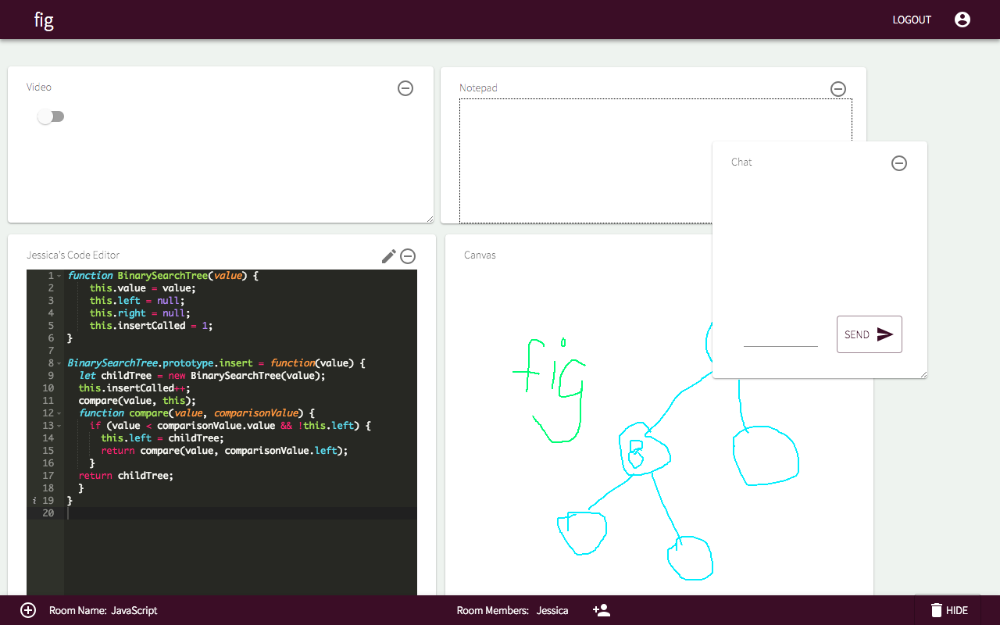

# fig

## A customizable and collaborative real-time classroom that allows users to tailor the learning environment to the needs of the subject matter. Users can dynamically add, move and hide various modules within the classroom (including chat, video, whiteboard, notepad, and code editors).

## View

Deployed on [https://capstone-fig-1806.herokuapp.com/](https://capstone-fig-1806.herokuapp.com/)

### Stack

- ReactJS
- Google Firestore
- Node Express
- React DnD
- Material UI

## Install

Clone this repository and install JS dev dependencies (listed in [package.json](package.json)):

```bash
npm install
npm run start-dev
```

View in your browser:

```bash
localhost:3000
```

## Screenshot



## Team

- [Jessica Hsu](https://github.com/hsujessica)
- [Zachary Margolies](https://github.com/zacharymargolies)
- [Synuhe Uribe](https://github.com/synuhe)
- [Liam Neville](https://github.com/lineville)
